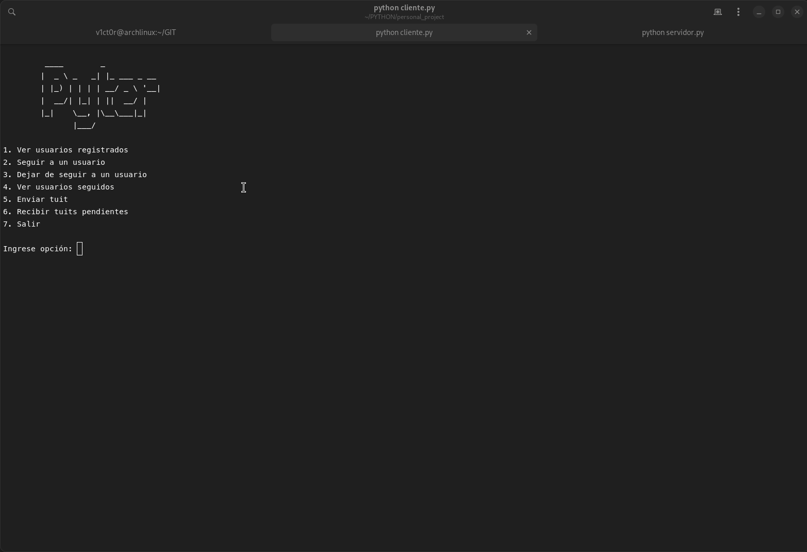

# Pyther

Pyther is a small client-server messaging program that uses gRPC.

## Overview

The server exposes several remote methods that can be called by clients. Each remote method has an input message (request) and a return message (reply). These methods exposed by the server are defined in a protobuf file with a `.proto` extension.

## gRPC Functionality

- Each method in the `.proto` file must have a parameter (Request) and a return (Reply). For example: `rpc Login (LoginRequest) returns (LoginReply) {}`
- Each Request and Reply parameter is a message. The structure of these messages is defined in the same file. A message consists of a series of fields, specifying the data type of each field.
- The protobuf file is "compiled" with a command and generates Python libraries that we must use in our code to:
  - On the server: implement the remote procedures defined in the `.proto`.
  - On the client: invoke the remote procedures defined in the `.proto`.
- On the client side, a "stub" object is created from the classes generated by gRPC and from there we can call the methods of the service defined in the proto.

## Project Structure

The project is structured into several Python files, each serving a specific purpose:

- `cliente_gui.py`: This file contains the client-side logic of the application. It includes functions for user registration, login, following and unfollowing users, viewing followed users, sending and receiving tweets, and logging out.
- `servidor.py`: This file contains the server-side logic of the application. It implements the remote procedures defined in the `.proto` file and handles client requests.
- `twitter.proto`: This is the protobuf file that defines the remote procedures and their request and reply messages.

## Running the Project

To run the project, you need to have Python and pip installed. You can then install the required dependencies and run the server and client scripts.





# gRPC Functionality

- The server exposes several remote methods that can be called by clients.
- Each remote method has an input message (request) and a return message (reply)
- These methods exposed by the server are defined in a protobuf file with a `.proto` extension. Each method in the `.proto` file must have a parameter (Request) and a return (Reply). For example: `rpc Login (LoginRequest) returns (LoginReply) {}`
- Each Request and Reply parameter is a message. The structure of these messages is defined in the same file. A message consists of a series of fields, specifying the data type of each field. For example, `LoginRequest` is the message necessary to perform the login. It would be:

```protobuf
message LoginRequest {
  string user = 1;
  string password = 2;
}
```

The number is not an initial value, but the order of the field within the message.

- The `LoginReply` is the return message of the Login procedure. The server responds depending on whether the login was successful or not. In this case it returns:

```protobuf
message LoginReply {
  int32 error = 1;
  int32 session = 2;
}
```

Where:
  - `error = 0`, no error, logged in correctly.
  - `error = 1`, incorrect user
  - `error = 2`, incorrect password
  - `session` is a session identifier. It will be a 4-digit numeric code unique for each active session.

- This protobuf file is "compiled" with a command and generates Python libraries that we must use in our code to:
  - On the server: implement the remote procedures defined in the `.proto`.
  - On the client: invoke the remote procedures defined in the `.proto`.
- On the client side, a "stub" object is created from the classes generated by gRPC and from there we can call the methods of the service defined in the proto.
